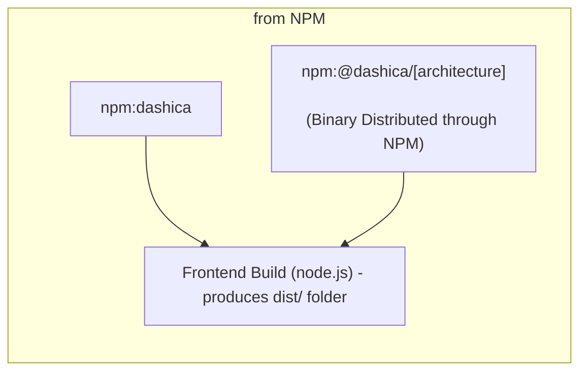
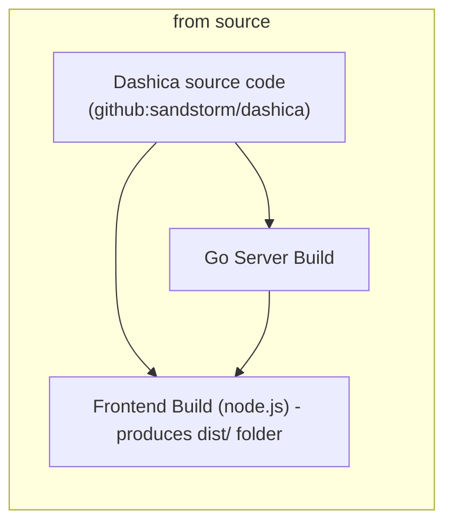
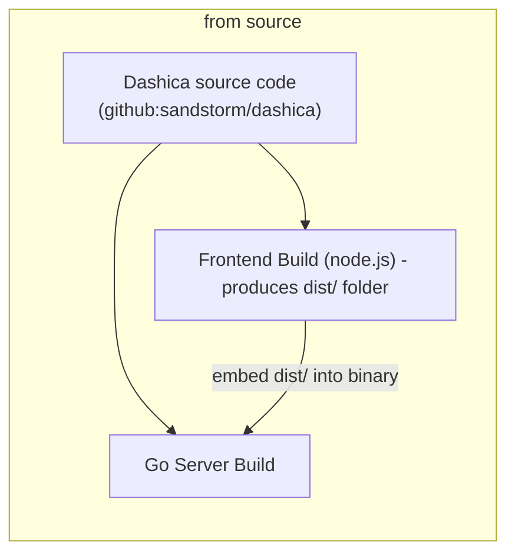

# Building & Deployment

Dashica consists of two parts:
- the server (written in Golang)
- the frontend (node.js / based on Observable Framework)

There are three ways to build Dashica, explained below

## Building from NPM (default)

**TODO: this route is not yet fully functioning, as we do not have a stable release yet.**



You'll pull in a **released dashica version** and a **pre-built server binary** from NPM.

Use this if you want to use the latest stable release.

Package.json looks as follows:

```json

{
  "dependencies": {
    "dashica": "^1.0.0", // !!! the dashica version you want to use
    "run-pty": "^5.0.0"
  },
  "type": "module",
  "scripts": {
    "dist": "dashica dist", // !!! distribute the pre-built server
    "clickhouse-cli": "dashica clickhouse-cli",

    "preview": "run-pty      % dashica preview-frontend        % dashica server --dev" // !!! start the pre-built server
  }
}
```

## Building from source



You'll pull in the current **source code of [sandstorm/dashica](https://github.com/sandstorm/dashica)** and **build the server yourself**.

Use this if you want to develop dashica in tandem with your project.

Package.json looks as follows:

```json

{
  "dependencies": {
    "dashica": "file:/path/to/dashica-src", // !!! path to Dashica Git Clone
    "run-pty": "^5.0.0"
  },
  "type": "module",
  "scripts": {
    "dist": "dashica dist --build /path/to/dashica-src", // !!! compile the server yourself
    "clickhouse-cli": "dashica clickhouse-cli",

    "preview": "run-pty      % dashica preview-frontend        % dashica server --dev --build /path/to/dashica-src" // !!! compile the server yourself
  }
}
```

## Building from source, as single static binary with embedded assets



You'll pull in the current **source code of [sandstorm/dashica](https://github.com/sandstorm/dashica)** and **build the server yourself**.

Use this if you **need a static binary for easiest deployment.**

Package.json looks as follows:

```json

{
  "dependencies": {
    "dashica": "file:/path/to/dashica-src", // !!! path to Dashica Git Clone
    "run-pty": "^5.0.0"
  },
  "type": "module",
  "scripts": {
    "dist": "dashica dist --build /path/to/dashica-src --embed", // !!! compile the server yourself, and EMBED the dist/ folder.
    "clickhouse-cli": "dashica clickhouse-cli",

    "preview": "run-pty      % dashica preview-frontend        % dashica server --dev --build /path/to/dashica-src" // !!! compile the server yourself
  }
}