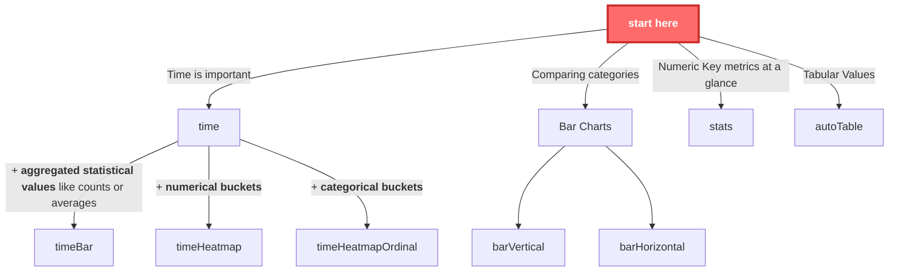

## Chart Types

Dashica offers multiple pre-configured [Observable Plot](https://observablehq.com/plot/getting-started) chart types to
visualize your data effectively. The key to selecting the right chart depends on understanding your data dimensions (x /
y usually, maybe additionally fill).

### Understanding Data Types

**Categorical/Ordinal Data:**

- Represents distinct, named categories with no inherent numerical value
- Examples: error levels (info, warn, error), server names, product types

**Numeric/Continuous Data:**

- Represents measurements on a continuous scale
- Examples: response times (ms), load times, CPU usage percentages

### Use the following rules to decide which chart type to use:

1. Time is important:
    1. the other dimension represents **aggregated statistical** values like *counts* or *averages*: use `timeBar`
    2. the other dimension represents **numerical buckets**, like *request times between 50-100ms,100-150ms,150-200ms*:
       use `timeHeatmap`
    3. the other dimension represents **categorical buckets**, like *customer A / B / C*: use: `timeHeatmapOrdinal`

2. Comparing categories: Use bar charts (`barVertical, barHorizontal`)

3. Key metrics at a glance: Use `stats`

**This is visualized again in the following diagram:**

## Common Chart Options

All charts have the following options:

- `viewOptions`: must match the global `viewOptions` as returned by `const viewOptions = view(component.viewOptions());`
  in the chart header.
- The `invalidation` promise is [from observable framework](https://observablehq.com/framework/reactivity#invalidation), and is a mechanism to know when the current cell needs to re-render.

- `title`: The chart title
- `height`: chart height in px
- all charts use 100% of their available width and are responsive.
- `marginLeft`: margin on the left side of the chart. extend if you need space for wider labels
- `marginTop`: margin on the top side of the chart. extend if you need space for wider labels
- `marginRight`: margin on the right side of the chart. extend if you need space for wider labels
- `marginBottom`: margin on the bottom side of the chart. extend if you need space for wider labels

