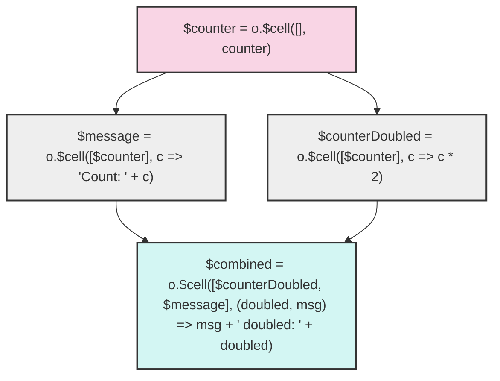

# Custom Reactivity in JavaScript with Observable Runtime

```js
import {withRuntime} from '/dashica/index.js';
```

# Introduction

Observable Framework is a JavaScript-based data visualization platform that provides powerful built-in reactivity between "cells" (individual code blocks) in notebooks. Similar to Jupyter notebooks but with automatic reactivity, Observable updates dependent cells when their inputs change.

Reactivity is limited to interactions between separate code blocks. Thus, when building complex components that need **internal reactivity between their parts, we need a different approach.**

This document introduces a custom solution that brings Observable's reactivity model inside your JavaScript functions, allowing you to:

1. Create reactive cells with dependencies within a single JavaScript component
2. Handle promises and generators automatically, just like Observable does between cells
3. Build reusable components with internal reactivity
4. Render reactive HTML content that updates when dependencies change

Our approach builds upon [earlier work](https://observablehq.com/d/aebbadaa71a6c0ae) but offers a simplified, type-safe API with comprehensive documentation. The `withRuntime` function creates an isolated Observable runtime environment, providing the tools you need to build complex reactive systems within a single function.

## Key Terms for Newcomers

- [Observable Framework](https://observablehq.com/framework/): A JavaScript-based platform for data visualization and reactive programming
- **Cell**: A discrete code block in Observable that can depend on other cells
- [Observable Runtime](https://github.com/observablehq/runtime): The underlying system that manages reactivity and updates in Observable
- [Generator](https://javascript.info/generators): A special JavaScript function that can yield multiple values over time

# Instantiation: `withRuntime`

`withRuntime` creates a new Observable runtime, injects, it (with a custom API) in the `o` Variable into the closure, and executes the closure.
The result of the closure is passed on as the result of `withRuntime` (as you would expect).

```js echo
display(withRuntime(o => {
    return "This value is returned."
}));
```
You can also store the result in a variable and use it later on, just as usual with Observable:

```js echo
const res = withRuntime(o => {
    return "This value is returned."
});
```
<code>${res}</code>
<pre>\${res}</pre>

# Understanding Reactive Cells

Let's visualize how cells work in the custom reactivity system with a basic example. In traditional Observable notebooks, cells can depend on each other, and when an upstream cell changes, all dependent cells are automatically recalculated. Our custom system brings this same behavior within a single code block.

## Basic Example: Reactive Cell Dependencies

The diagram below shows a simple reactive system with four cells:

1. `$counter` - A source cell that provides a number value
2. `$counterDoubled` - Depends on `$counter`, doubles its value
3. `$message` - Depends on `$counter`, formats it as a message
4. `$combined` - Depends on both `$counterDoubled` and `$message`, combines their values



When `$counter` changes (e.g., when a button is clicked), all dependent cells automatically update in the correct order:

Here's how this system works in practice:

```ts echo
// Data flow:
// User clicks button → $counter updates → $counterDoubled and $message recalculate → $combined recalculates
withRuntime(o => {
    const $counter = o.$cell([], counter);  // Source cell
    const $counterDoubled = o.$cell([$counter], c => c * 2);  // Depends on $counter
    const $message = o.$cell([$counter], c => `Count: ${c}`);  // Also depends on $counter
    const $combined = o.$cell([$counterDoubled, $message],
        (doubled, msg) => `${msg}, doubled: ${doubled}`);  // Depends on both
});
```

## Key Concepts

1. **Cell Creation**: Each reactive value is created with `o.$cell(dependencies, definition)`
2. **Dependencies**: The first argument is an array of other cells this cell depends on
3. **Definition**: The second argument is a function that computes the cell's value based on its dependencies
4. **Automatic Updates**: When any dependency changes, all affected cells recalculate automatically
5. **Async Support**: Cells handle promises and generators automatically

The reactive system ensures:
- Cells only update when their dependencies change
- Updates happen in the correct order (topological sort)
- Async operations (promises/generators) are handled seamlessly

This approach allows you to build complex reactive systems within a single code block, rather than being limited to notebook-level reactivity.

# Create Cells via `o.$cell`

A cell can emit arbitrary values, but Promises and Generators (`yield`) are handled specially by Observable Runtime:

- Promises are waited for; and only then dependent cells are computed.
- Every time the generator emits a new value, the dependent cells are recomputed.

To create new cells, use the `o.$cell(inputs, definition)` function:
- `inputs` is an array of other cells
- `definition` is a callback function which gets all current cell values; and has to return the new cell value.

## Creating input cells with no dependencies - i.e. static Values

<div class="tip">
    We render the value using <code>o.$inspect()</code>, which returns a HTML DOM Node with the live-displayed output. This will be introduced later in detail.
</div>

This creates a cell with a static value.

```js echo
{
    display(withRuntime(o => {
        const $myValue = o.$cell([], () => "My value");
        return o.$inspect($myValue);
    }));
}
```

In case of static values, instead of `o.$cell([], () => "My value")`, we can also directly return the static value via `o.$cell([], "My value")`:

```js echo
{
    display(withRuntime(o => {
        const $myValue = o.$cell([], "My value");
        return o.$inspect($myValue);
    }));
}
```

## Creating cells with Dependencies on other cells

<div class="note">

**Setting the stage: Building a Generator you can trigger**

As setup, we need a `Generator` for values. This is done via `const counter = view(Inputs.button("Increase Counter"))`
(see [Button input](https://observablehq.com/framework/inputs/button)): 
- this renders a button
- counter is a `Generator<int>`
- each time you click, the counter is incremented.

This can be seen in the following example:

```js echo
// In Observable, this creates a button that generates a stream of numbers
// Each click increments the counter value (1, 2, 3, etc.)
const counter = view(Inputs.button("Increase Counter"));
```

${counter}
<pre>\${counter}</pre>

Now, when we embed this in a SINGLE cell (without spanning two cells such as above), we get access to the Generator
itself (which is what we need for our examples below).

</div>

To depend on a cell, reference it in the 1st parameter, and then calculate the resulting value.

```js echo
{
    const counter = view(Inputs.button("Increase Counter"));
    // Outputs $counter*2
    display(withRuntime(o => {
        const $counter = o.$cell([], counter);
        const $counterDoubled = o.$cell([$counter], counter => counter * 2);
        return o.$inspect($counterDoubled);
    }))
}
```

In the same manner, you can depend on multiple cells.

Remember: If cells emit promises or generators, this will just work. Example:

```js echo
{
    const counter = view(Inputs.button("Increase Counter"));
    
    // Outputs $counter*2, even though a Promise is returned.
    display(withRuntime(o => {
        const $counter = o.$cell([], counter);
        const $counterDoubled = o.$cell([$counter], counter => Promise.resolve(counter * 2));
        return o.$inspect($counterDoubled);
    }))
}
```

## Error Cases

We try to provide good error messages.

<details><summary>Expand Error Cases</summary>

```js echo
{
    // Not correct number of arguments
    display(withRuntime(o => {
        const $errored = o.$cell("foo", "bar", "bar");
    }));
}
```

```js echo
{
    // no cells as parameters (1)
    display(withRuntime(o => {
        const $errored = o.$cell(["foo"], () => null);
    }));
}
```

```js echo
{
    // no cells as parameters (1)
    display(withRuntime(o => {
        const $errored = o.$cell([{foo: "bar"}], () => null);
    }));
}
```

</details>

# Using Widgets

**Widgets** are interactive elements like inputs.

In Observable, they are created by a **function** that:

- returns an 🧱 [**HTML Element**](https://developer.mozilla.org/en-US/docs/Web/API/Element)
- and returns the 🎯 user selection in the **value** attribute of the element.
- and (sometimes) receives:
  - some 🗃️ **input data** (usually in tidy format)
  - an 🎛️ **options** object
- and 📣 **emits** *input* events when there is an user interaction
- and 👂🏼 **listens** to *input* to the same event to reflect changes made on other widgets

(taken from [Reusable and Reactive Visualization Widgets or Components,  IEEE VIS 2024](https://observablehq.com/@john-guerra/reactive-widgets))


## Render HTML and widgets via `o.render` Tagged-Template-Literal

<div class="warning">
You should NOT use <code>o.render()</code> as function, but instead as tagged template literal via <code>o.render`...`</code>
</div>

Usually, you want to combine existing widgets with arbitrary HTML - so best is to use
`o.render...` for outputting. Use this as tagged template literal. Cells are rendered via
Observable's [Inspector](https://github.com/observablehq/inspector/), just like with normal
Observable Framework.

```js echo
{
    display(withRuntime(o => {
        const $counter = o.$cell([], Inputs.button("Increase Counter"));
        return o.render`<div>
            Mein Custom markup - hier der ${$counter} button.
        </div>`;
    }))
}
```

## Access the Widget's Value Stream via `o.$widgetValues($widgetCell)`

If you use widgets in cells, the *Widget DOM Element* is returned. To receive
the Widget's value stream, use `o.$widgetValues($widgetCell)`:

```js echo
{
  display(withRuntime(o => {
    const $counter = o.$cell([], Inputs.button("Increase Counter"));
    return o.render`<div>
            Mein Custom markup - hier der ${$counter} button und die Zahl: ${o.$widgetValues($counter)}
        </div>`;
  }))
}
```

This is also possible as input of other cells:

```js echo
{
  display(withRuntime(o => {
    const $counter = o.$cell([], Inputs.button("Increase Counter"));
    const $counterTimesTwo = o.$cell([o.$widgetValues($counter)], (counter) => counter*2);
    return o.render`<div>
            Mein Custom markup - hier der ${$counter} button und die Zahl: ${$counterTimesTwo}
        </div>`;
  }))
}
```

## Error Cases

We try to provide good error messages.

<details><summary>Expand Error Cases</summary>

```js echo
{
    // render must be used as tagged template literal (1)
    display(withRuntime(o => {
        o.render(`Hallo Welt`);
    }));
}
```

```js echo
{
    // render must be used as tagged template literal (1)
    display(withRuntime(o => {
        o.render([`Hallo Welt`, 42]);
    }));
}
```

```js echo
{
    // $foo must be Widget
    display(withRuntime(o => {
        const $foo = o.$cell([], "foo")
        return o.$inspect(o.$widgetValues($foo));
    }));
}
```

</details>

# Complex Examples

```js echo
{
  display(withRuntime(o => {
    const $counter = o.$cell([], Inputs.text("my text"));
    const $counterTimesTwo = o.$cell([o.$widgetValues($counter)], (counter) => counter*2);
    return o.render`<div>
            Mein Custom markup - hier der ${$counter} button und die Zahl: ${$counterTimesTwo}
        </div>`;
  }))
}
```

# Reference

The `o` object has many useful functions:

# Reference `o.{$....}`